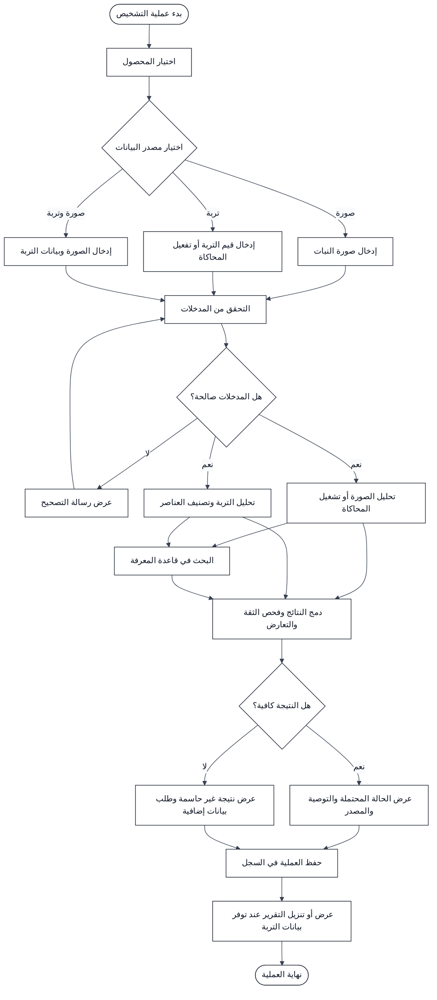

# مخطط النشاط لعملية التشخيص

## 1. الغرض من المخطط

يوضح هذا المخطط التسلسل العملي لعملية التشخيص داخل نظام الخبير الزراعي، بدايةً من اختيار المحصول وإدخال البيانات، وانتهاءً بعرض النتيجة والتوصية وحفظ العملية في السجل.

يدعم النظام ثلاثة أوضاع للتشخيص: تحليل الصورة، وتحليل التربة، والتحليل المدمج عند توفر المصدرين.

## 2. مخطط النشاط

## 3. شرح المراحل

| المرحلة | وصف النشاط |
|---|---|
| بدء العملية | يفتح المستخدم وظيفة التشخيص من الواجهة الرئيسية. |
| اختيار المحصول | يحدد المستخدم المحصول لتقليل نطاق البحث واختيار القواعد المناسبة. |
| اختيار المصدر | يحدد المستخدم استخدام الصورة أو التربة أو المصدرين معًا. |
| إدخال البيانات | يستقبل النظام الصورة أو قيم التربة أو القراءة المحاكاة. |
| التحقق | يفحص النظام وجود المدخلات وصيغتها ونطاق قيمها. |
| التحليل | تنفذ وحدة الصورة ووحدة التربة المعالجة المناسبة. |
| البحث المعرفي | يسترجع النظام الحالات والأعراض والتوصيات المرتبطة بالمحصول. |
| الدمج | يقارن النظام المؤشرات ويحدد الاتفاق أو التعارض ودرجة الثقة. |
| عرض النتيجة | يعرض النظام النتيجة والتوصية والمصدر والتنبيه الإرشادي. |
| حفظ العملية | يحفظ النظام ملخص العملية حتى يستطيع المستخدم مراجعتها لاحقًا. |

## 4. المسارات البديلة

إذا كانت المدخلات غير صالحة، يعرض النظام رسالة توضح الخطأ ويعيد المستخدم إلى مرحلة الإدخال. وإذا كانت درجة الثقة منخفضة أو لم تتوفر معرفة كافية، يعرض النظام نتيجة غير حاسمة ويطلب صورة أوضح أو بيانات إضافية.

عند تعارض نتيجة الصورة مع نتيجة التربة، لا يختار النظام أحد المصدرين بصورة مخفية. بل يعرض المؤشرات المتعارضة والتنبيه المناسب، ثم يقدم نتيجة إرشادية غير قطعية.

عند عدم توفر حساس فعلي، يستخدم المستخدم وضع محاكاة التربة. ولا يعتمد هذا الوضع على اتصال خارجي.

## 5. قواعد الانتقال

| الشرط | الانتقال |
|---|---|
| لم يُحدد المحصول | منع بدء العملية وطلب الاختيار |
| صورة غير صالحة | رفض الصورة والعودة إلى الإدخال |
| قيمة تربة ناقصة أو خارج النطاق | عرض الحقل المطلوب وتصحيح القيمة |
| بيانات صحيحة | بدء التحليل والبحث |
| ثقة كافية ومعرفة موثقة | عرض النتيجة والتوصية |
| ثقة منخفضة أو تعارض | عرض نتيجة غير حاسمة وتنبيه إرشادي |
| اكتمال العرض | حفظ العملية في السجل |

## 6. التتبع

يرتبط هذا المخطط بحالات الاستخدام الخاصة بتحليل الصورة، وتحليل التربة، ودمج النتائج، وعرض التقرير، وإدارة سجل العمليات في وثيقة تحليل حالات الاستخدام.

## المراجع

[1]: https://github.com/aymanalwahbi9-ship-it/agricultural-expert-se-project/blob/main/docs/USE_CASE_ANALYSIS.md "وثيقة تحليل حالات استخدام نظام الخبير الزراعي"
[2]: https://github.com/aymanalwahbi9-ship-it/agricultural-expert-se-project/blob/main/docs/SYSTEM_DESIGN.md "وثيقة تصميم نظام الخبير الزراعي"
[3]: https://github.com/aymanalwahbi9-ship-it/agricultural-expert-se-project/blob/main/docs/USE_CASE_DIAGRAM.md "مخطط حالات استخدام نظام الخبير الزراعي"
