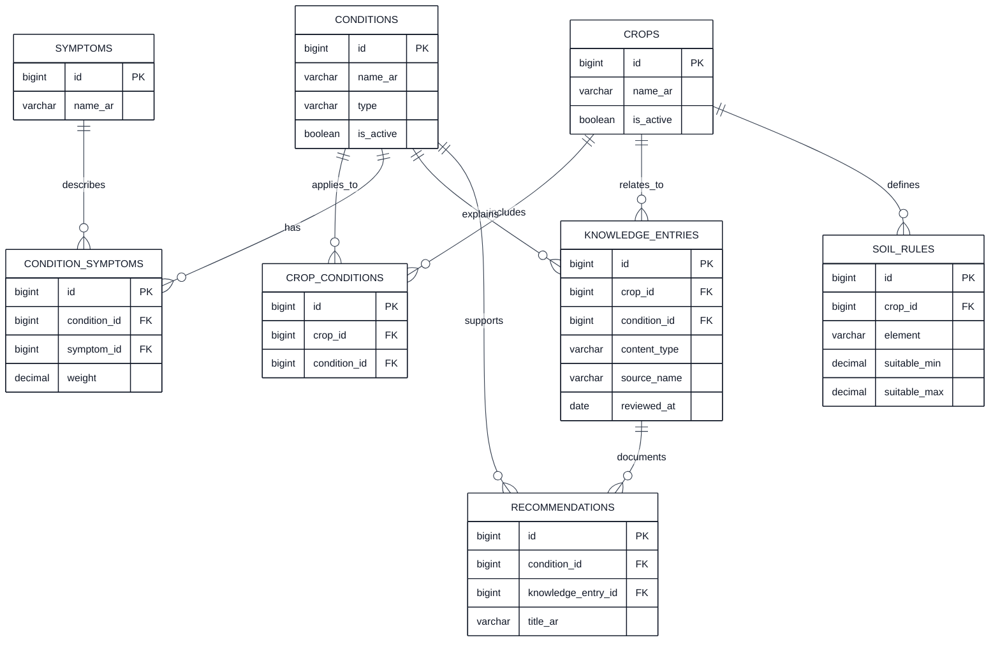
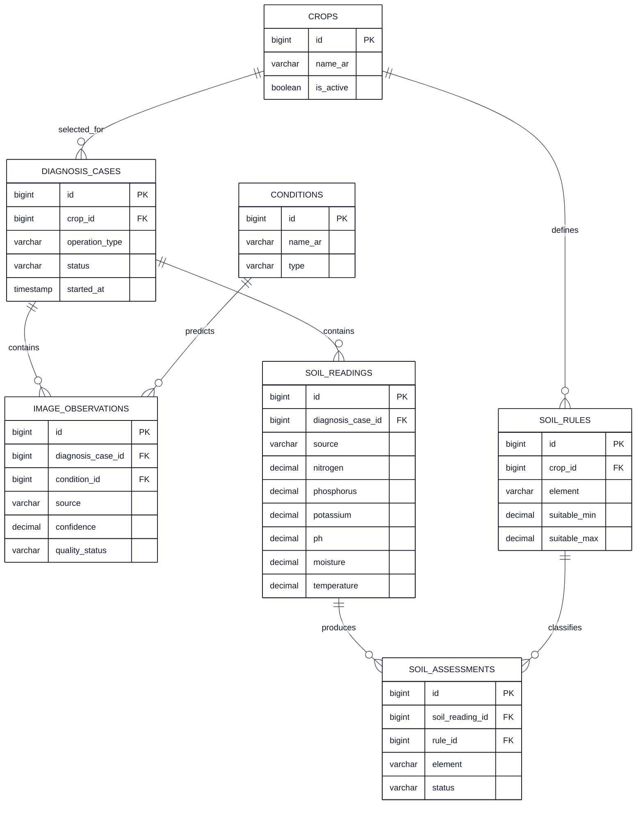
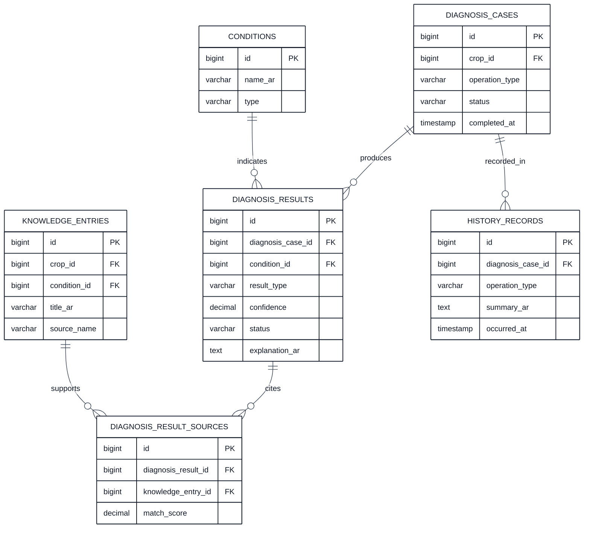

# مخطط الكيانات والعلاقات لقاعدة بيانات نظام الخبير الزراعي

## 1. الغرض من المخطط

يوضح هذا الملف العلاقات بين جداول قاعدة بيانات نظام الخبير الزراعي. قُسّم المخطط إلى ثلاثة أجزاء حتى تكون الجداول والعلاقات واضحة عند عرضها داخل GitHub.

## 2. مخطط المعرفة والمحاصيل

يوضح هذا الجزء المحاصيل والحالات والأعراض وقاعدة المعرفة والتوصيات وقواعد التربة.

## 3. مخطط مدخلات التشخيص

يوضح هذا الجزء العملية التي تبدأ عند اختيار المحصول، ثم حفظ الصورة وقراءة التربة وتصنيف عناصرها.

## 4. مخطط النتائج والسجل

يوضح هذا الجزء النتيجة التي يعرضها النظام، ومصادر المعرفة التي دعمتها، وسجل العملية.

## 5. قراءة العلاقات

يرتبط المحصول بالحالات الزراعية من خلال `CROP_CONDITIONS`، وترتبط الحالات بالأعراض من خلال `CONDITION_SYMPTOMS`. وتخزن `KNOWLEDGE_ENTRIES` المعلومات الموثقة التي يستخدمها البحث ومحرك القرار.

تمثل `DIAGNOSIS_CASES` عملية تشخيص واحدة. ويمكن أن تحتوي العملية على صورة أو قراءة تربة أو كليهما. وتنتج عملية التشخيص سجلًا أو أكثر من النتائج، وترتبط النتيجة بالمصادر التي دعمتها عبر `DIAGNOSIS_RESULT_SOURCES`.

## 6. ملاحظات التصميم

تستخدم أسماء الجداول بصيغة الجمع وبالإنجليزية بما يتوافق مع اصطلاحات Laravel. ولا يتضمن الإصدار الحالي جدولًا للمستخدمين؛ لأن نطاق المشروع يعتمد على مستخدم زراعي واحد وسجل محلي.

تظهر الجداول المشتركة في أكثر من مخطط عند الحاجة إلى توضيح العلاقة. ولا يعني تكرار الجدول إنشاءه أكثر من مرة في قاعدة البيانات.

## المراجع

[1]: https://github.com/aymanalwahbi9-ship-it/agricultural-expert-se-project/blob/main/docs/DATABASE_DESIGN.md "وثيقة تصميم قاعدة بيانات نظام الخبير الزراعي"
[2]: https://github.com/aymanalwahbi9-ship-it/agricultural-expert-se-project/blob/main/docs/SYSTEM_DESIGN.md "وثيقة تصميم نظام الخبير الزراعي"
[3]: https://github.com/aymanalwahbi9-ship-it/agricultural-expert-se-project/blob/main/docs/USE_CASE_ANALYSIS.md "وثيقة تحليل حالات استخدام نظام الخبير الزراعي"
