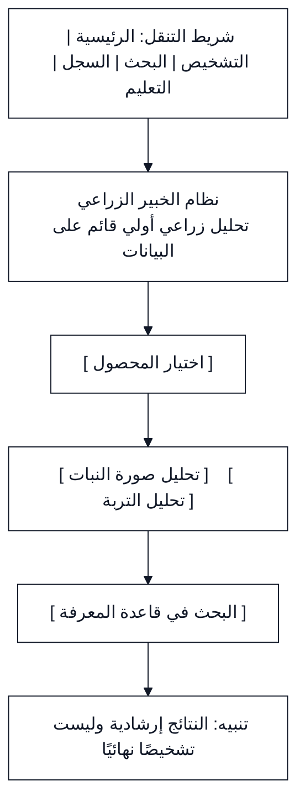
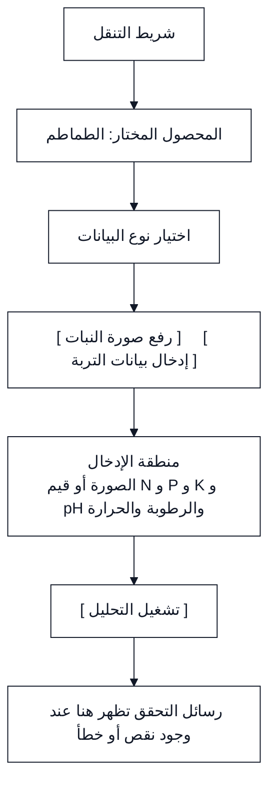
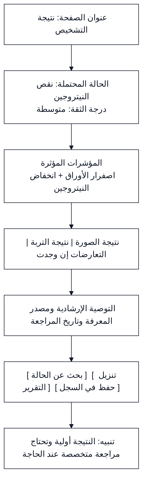
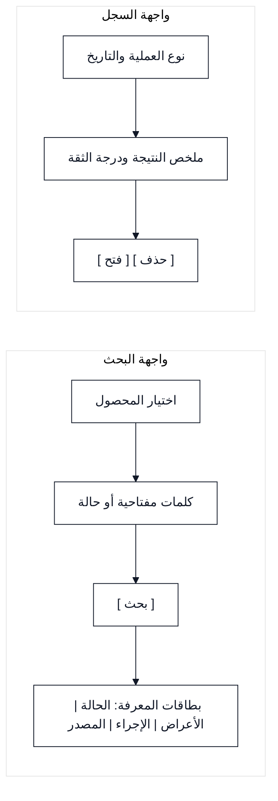

# تصميم واجهات نظام الخبير الزراعي

## 1. الغرض من الوثيقة

تحدد هذه الوثيقة الواجهات الرئيسية لنظام الخبير الزراعي، ومحتوى كل صفحة، ومدخلاتها ومخرجاتها، ومسارات الانتقال بينها. تم تصميم الواجهات لتكون عربية وواضحة وتعمل باتجاه من اليمين إلى اليسار باستخدام Blade وTailwind CSS.

لا تمثل هذه الوثيقة تصميمًا بصريًا نهائيًا بالألوان والصور. بل تحدد الهيكل الوظيفي للصفحات قبل تنفيذها في Laravel.

## 2. مبادئ تصميم الواجهة

| المبدأ | التطبيق |
|---|---|
| الوضوح | تعرض كل صفحة وظيفة أساسية واحدة ومسارًا واضحًا للخطوة التالية |
| اللغة العربية | تستخدم العناوين والرسائل العربية وباتجاه من اليمين إلى اليسار |
| التدرج | يطلب النظام البيانات على مراحل بدل عرض نموذج طويل دفعة واحدة |
| الشفافية | تعرض النتيجة ومصدرها ودرجة الثقة والتنبيه الإرشادي |
| التعامل مع الخطأ | تظهر رسالة مفهومة بجوار الحقل أو العملية التي تحتاج إلى تصحيح |
| الاستجابة | تتكيف الواجهات مع شاشة الحاسوب والهاتف |
| قابلية الوصول | تستخدم عناوين واضحة وتباينًا مناسبًا وأزرارًا قابلة للفهم |

## 3. خريطة الواجهات

```text
الصفحة الرئيسية
├── اختيار المحصول
├── تحليل صورة النبات
├── تحليل التربة
├── البحث في قاعدة المعرفة
├── سجل العمليات
└── المركز التعليمي
```

## 4. الواجهة الرئيسية

### الهدف

تقدم نقطة الدخول إلى وظائف النظام الرئيسية وتشرح بإيجاز أن النتائج إرشادية وليست تشخيصًا نهائيًا.

### المكونات

- عنوان النظام ووصف مختصر.
- زر اختيار المحصول.
- بطاقة تحليل صورة النبات.
- بطاقة تحليل التربة.
- بطاقة البحث في قاعدة المعرفة.
- رابط سجل العمليات.
- رابط المركز التعليمي.
- تنبيه عام حول حدود النتيجة.

### الانتقالات

| الإجراء | الوجهة |
|---|---|
| الضغط على اختيار المحصول | صفحة اختيار المحصول |
| الضغط على تحليل الصورة | صفحة تحليل الصورة |
| الضغط على تحليل التربة | صفحة تحليل التربة |
| الضغط على البحث | صفحة قاعدة المعرفة |
| الضغط على السجل | صفحة سجل العمليات |
| الضغط على التعليم | صفحة المركز التعليمي |

## 5. صفحة اختيار المحصول

### الهدف

تحديد المحصول قبل بدء التحليل أو البحث حتى يستطيع النظام تصفية الحالات والقواعد والمعرفة المرتبطة به.

### المدخلات

- قائمة المحاصيل المدعومة.
- خيار متابعة إلى تحليل الصورة.
- خيار متابعة إلى تحليل التربة.
- خيار متابعة إلى البحث المعرفي.

### التحقق

لا يسمح النظام بالمتابعة قبل اختيار محصول. ويعرض رسالة واضحة عند محاولة المتابعة دون اختيار.

## 6. صفحة تحليل صورة النبات

### الهدف

استقبال صورة النبات وتشغيل تحليل الصورة الفعلي أو المحاكى.

### المكونات

- عرض المحصول المختار.
- حقل التقاط صورة أو اختيار ملف.
- تعليمات قصيرة للحصول على صورة واضحة.
- زر تشغيل التحليل.
- مؤشر حالة المعالجة.
- رسالة التحقق من النوع والحجم والجودة.

### النتيجة

تعرض الصفحة الحالة المحتملة، ودرجة الثقة، والصفات المرئية، والتنبيه الإرشادي، وزر البحث عن الحالة في قاعدة المعرفة.

### الحالات البديلة

| الحالة | الرسالة أو الإجراء |
|---|---|
| ملف غير مدعوم | يطلب النظام اختيار صورة بصيغة مدعومة |
| حجم كبير | يوضح النظام الحد المقبول ويطلب صورة أخرى |
| جودة منخفضة | يطلب النظام إعادة الصورة |
| ثقة منخفضة | يعرض النتيجة بوصفها غير حاسمة ويطلب بيانات إضافية |

## 7. صفحة تحليل التربة

### الهدف

استقبال قيم التربة يدويًا أو تشغيل وضع المحاكاة، ثم عرض تصنيف العناصر والتوصية الأولية.

### المدخلات

| الحقل | الوصف |
|---|---|
| مصدر القراءة | حساس أو إدخال يدوي أو محاكاة |
| النيتروجين | قيمة ووحدة القياس |
| الفوسفور | قيمة ووحدة القياس |
| البوتاسيوم | قيمة ووحدة القياس |
| درجة الحموضة | قيمة pH |
| الرطوبة | قيمة ووحدة القياس |
| درجة الحرارة | قيمة ووحدة القياس |

### النتيجة

تعرض الصفحة جدولًا يبين القيمة والوحدة وتصنيف كل عنصر، ثم تعرض مصدر القراءة ووقتها والتوصية الأولية والتنبيه الخاص بحدود التحليل.

### الإجراءات

- تشغيل التحليل.
- إعادة ضبط القيم.
- تنزيل تقرير التربة.
- العودة إلى اختيار المحصول.

## 8. صفحة نتيجة التشخيص

### الهدف

عرض النتيجة بصورة مفسرة، سواء كانت ناتجة عن الصورة أو التربة أو دمج المصدرين.

### المكونات

- نوع النتيجة.
- المحصول المختار.
- الحالة المحتملة.
- درجة الثقة وتصنيفها.
- المؤشرات التي دعمت النتيجة.
- نتيجة الصورة عند توفرها.
- نتيجة التربة عند توفرها.
- التعارضات بين المصادر عند وجودها.
- التوصية المرتبطة بمصدر معرفة.
- مصدر المعرفة وتاريخ مراجعته.
- التنبيه بأن النتيجة إرشادية.

### الإجراءات

- البحث عن الحالة في قاعدة المعرفة.
- إضافة بيانات أو إعادة الصورة.
- تنزيل التقرير عند توفر بيانات التربة.
- حفظ النتيجة في السجل.
- العودة إلى الصفحة الرئيسية.

## 9. صفحة البحث في قاعدة المعرفة

### المدخلات

- المحصول.
- الحالة أو العرض.
- كلمات مفتاحية.
- خيار استخدام المرادفات المحلية عند توفر الوظيفة.

### النتيجة

يعرض النظام بطاقات أو قائمة تحتوي على اسم الحالة والأعراض والإجراء الأولي ومصدر المعرفة وتاريخ المراجعة. وإذا لم يجد معلومات كافية، يعرض رسالة صريحة ولا ينشئ توصية من عنده.

## 10. صفحة سجل العمليات

### الهدف

تمكين المستخدم من مراجعة عمليات التحليل والبحث السابقة.

### المكونات

- نوع العملية.
- المحصول.
- ملخص النتيجة.
- التاريخ والوقت.
- درجة الثقة عند توفرها.
- زر إعادة الفتح.
- زر حذف عملية واحدة.
- زر مسح السجل.

يطلب النظام تأكيدًا قبل حذف السجل كاملًا، لأن هذا الإجراء يزيل بيانات المستخدم من العرض المحلي.

## 11. صفحة المركز التعليمي

### الهدف

شرح فكرة النظام ومسار البيانات وقاعدة المعرفة والمحاكاة بصورة مبسطة.

### الأقسام

- ما هو نظام الخبير الزراعي؟
- كيف يعمل مسار التشخيص؟
- ما الفرق بين تحليل الصورة وتحليل التربة؟
- كيف تستخدم قاعدة المعرفة؟
- ما معنى درجة الثقة؟
- لماذا قد تكون النتيجة غير حاسمة؟
- ما الفرق بين القراءة الفعلية والقراءة المحاكاة؟
- ما حدود النتيجة الإرشادية؟

تستخدم الصفحة أقسامًا قابلة للفتح والطي لتقليل ازدحام المحتوى.

## 12. عناصر الواجهة المشتركة

| العنصر | الاستخدام |
|---|---|
| شريط التنقل | الانتقال بين الرئيسية والتحليل والبحث والسجل والتعليم |
| مؤشر المسار | توضيح مكان المستخدم داخل العملية |
| زر الرجوع | العودة إلى الخطوة السابقة دون فقدان البيانات عند الإمكان |
| رسائل النجاح | تأكيد اكتمال التحليل أو الحفظ |
| رسائل الخطأ | توضيح المشكلة وطريقة التصحيح |
| بطاقة التنبيه | توضيح انخفاض الثقة أو تعارض المصادر أو حدود النتيجة |
| التذييل | عرض اسم النظام وبيان حدود الاستخدام |

## 13. مسار المستخدم المقترح

```text
الرئيسية
   ↓
اختيار المحصول
   ↓
اختيار نوع التحليل
   ↓
إدخال الصورة أو بيانات التربة
   ↓
التحقق والمعالجة
   ↓
صفحة النتيجة
   ↓
البحث الإضافي أو التقرير أو السجل
```

## 14. ربط الواجهات بحالات الاستخدام

| الواجهة | حالات الاستخدام المرتبطة |
|---|---|
| الرئيسية | تشغيل التطبيق والوصول إلى الوظائف |
| اختيار المحصول | اختيار المحصول |
| تحليل الصورة | تحليل صورة النبات وإعادة الصورة |
| تحليل التربة | تحليل التربة بالمحاكاة وعرض التقرير |
| البحث | البحث في قاعدة المعرفة والبحث من نتيجة الصورة |
| النتيجة | دمج النتائج وعرض التوصية والتنبيه |
| السجل | إدارة سجل العمليات |
| المركز التعليمي | استخدام المركز التعليمي |

## 15. المكونات المقترحة في Laravel

| المكون | المسؤولية |
|---|---|
| `layouts/app.blade.php` | التخطيط العام واتجاه RTL والتنقل |
| `home.blade.php` | الصفحة الرئيسية |
| `crops/select.blade.php` | اختيار المحصول |
| `diagnosis/image.blade.php` | إدخال وتحليل الصورة |
| `diagnosis/soil.blade.php` | إدخال وتحليل التربة |
| `diagnosis/result.blade.php` | عرض النتيجة |
| `knowledge/index.blade.php` | البحث في قاعدة المعرفة |
| `history/index.blade.php` | عرض السجل |
| `education/index.blade.php` | المركز التعليمي |

## المراجع

[1]: https://github.com/aymanalwahbi9-ship-it/agricultural-expert-se-project/blob/main/docs/REQUIREMENTS.md "وثيقة متطلبات نظام الخبير الزراعي"
[2]: https://github.com/aymanalwahbi9-ship-it/agricultural-expert-se-project/blob/main/docs/USE_CASE_ANALYSIS.md "وثيقة تحليل حالات استخدام نظام الخبير الزراعي"
[3]: https://github.com/aymanalwahbi9-ship-it/agricultural-expert-se-project/blob/main/docs/SYSTEM_DESIGN.md "وثيقة تصميم نظام الخبير الزراعي"

## 16. مخططات Wireframe للواجهات الرئيسية

تمثل المخططات الآتية الهيكل المرئي الأولي للصفحات. لا تمثل هذه المخططات التصميم النهائي للألوان، لكنها توضح أماكن المكونات وتسلسل المعلومات قبل تنفيذ Blade.

### 16-1 Wireframe الصفحة الرئيسية



### 16-2 Wireframe صفحة إدخال التشخيص



### 16-3 Wireframe صفحة النتيجة



### 16-4 Wireframe صفحة البحث والسجل



### 16-5 قواعد قراءة الـ Wireframe

يمثل كل مستطيل منطقة أو مكونًا في الصفحة. يوضح السهم اتجاه الانتقال أو ترتيب ظهور المعلومات. وتمثل الأزرار بين قوسين مربعين إجراءات يمكن للمستخدم تنفيذها. ستتحول هذه المناطق لاحقًا إلى مكونات Blade وحقول Forms وبطاقات نتائج.


## 17. ملاحظة حول الرسومات

توجد رسومات الـ Wireframe داخل هذا الملف مباشرة بصيغة Mermaid، لذلك لا يحتاج المشروع إلى ملف صور منفصل أو ملف مصدر مستقل لهذه الرسومات. يعرض GitHub الرسومات عند فتح الملف في وضع القراءة أو المعاينة المدعوم.
