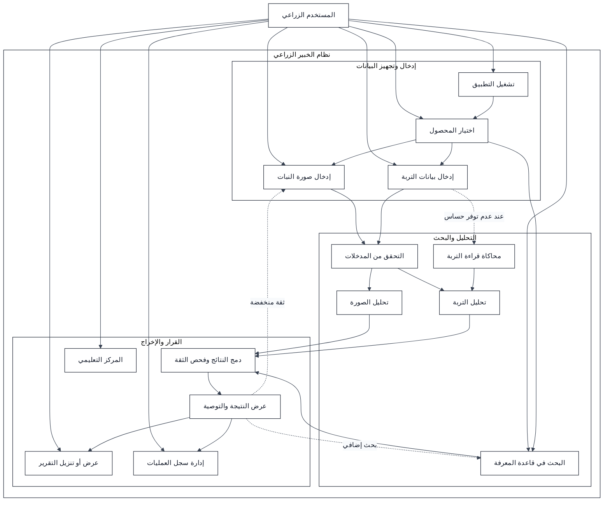

# مخطط حالات الاستخدام لنظام الخبير الزراعي

## 1. الغرض من المخطط

يوضح هذا المخطط الوظائف التي يستطيع المستخدم الزراعي تنفيذها داخل النظام، والخدمات التي يقدمها النظام استجابةً لهذه العمليات. يعتمد المخطط على حالات الاستخدام الواردة في وثيقة تحليل النظام، ولا يضيف أدوارًا إدارية غير موجودة في نطاق الإصدار الحالي.

## 2. الممثل الرئيسي

الممثل المباشر في الإصدار الحالي هو **المستخدم الزراعي**. يستطيع المستخدم اختيار المحصول، وإدخال بيانات الصورة والتربة، وتشغيل التحليل، والبحث في قاعدة المعرفة، ومراجعة النتائج والسجل والمركز التعليمي.

تعمل قاعدة المعرفة ومحرك القرار وخدمات التحليل كمكونات داخلية للنظام، وليست ممثلين بشريين مستقلين.

## 3. المخطط

## 4. وصف حالات الاستخدام

| الرقم | حالة الاستخدام | الممثل | النتيجة الأساسية |
|---|---|---|---|
| 1-1 | تشغيل التطبيق والوصول إلى الوظائف | المستخدم الزراعي | تظهر الواجهة الرئيسية والوحدات المتاحة |
| 1-2 | اختيار المحصول | المستخدم الزراعي | يحدد النظام نطاق البحث والقواعد المناسبة للمحصول |
| 1-3 | تحليل صورة النبات | المستخدم الزراعي | تظهر حالة محتملة ودرجة ثقة وصفات مرئية |
| 1-4 | إعادة الصورة | المستخدم الزراعي | يستقبل النظام صورة بديلة عند ضعف الجودة أو الثقة |
| 1-5 | تحليل التربة | المستخدم الزراعي | تصنف قيم التربة وتظهر التوصية الأولية |
| 1-6 | البحث في قاعدة المعرفة | المستخدم الزراعي | تظهر مقاطع معرفة مرتبطة بالمحصول والحالة |
| 1-7 | البحث من نتيجة الصورة | المستخدم الزراعي | يبدأ النظام بحثًا معرفيًا بالحالة الناتجة من الصورة |
| 1-8 | دمج النتائج | النظام بعد تشغيل مصادر متعددة | تظهر نتيجة مدمجة أو رسالة بعدم الحسم |
| 1-9 | عرض وتنزيل التقرير | المستخدم الزراعي | يعرض أو ينزل تقرير التربة والنتائج المرتبطة |
| 1-10 | إدارة سجل العمليات | المستخدم الزراعي | يفتح المستخدم عملية سابقة أو يحذفها |
| 1-11 | استخدام المركز التعليمي | المستخدم الزراعي | يقرأ شرحًا مبسطًا عن النظام ومسار البيانات |

## 5. العلاقات المهمة

ترتبط عملية تحليل الصورة وعملية تحليل التربة بالتحقق من المدخلات قبل بدء المعالجة. ويمكن تشغيل محاكاة التربة عندما لا يتوفر حساس فعلي. وترتبط نتيجة الصورة بالبحث في قاعدة المعرفة عندما يرغب المستخدم في معرفة تفاصيل إضافية.

لا تُعرض النتيجة المدمجة إلا بعد أن يفصل النظام مخرجات الصورة والتربة والمعرفة، ثم يمررها إلى محرك القرار لفحص درجة الثقة والاتفاق والتعارض.

## 6. الحالات البديلة

| الحالة | تعامل النظام |
|---|---|
| صورة بصيغة غير مدعومة | يرفض النظام الملف ويطلب صورة أخرى |
| صورة منخفضة الجودة أو الثقة | يطلب النظام إعادة الصورة أو إضافة بيانات أخرى |
| قيمة تربة ناقصة أو خارج النطاق | يحدد النظام الحقل ويمنع التحليل حتى التصحيح |
| عدم توفر حساس | ينتقل المستخدم إلى وضع محاكاة القراءة |
| عدم وجود معرفة كافية | يعرض النظام النتيجة دون توصية قطعية |
| تعارض نتيجة الصورة والتربة | يعرض النظام التعارض ويمنع القرار الحاسم |
| انقطاع الإنترنت | يستمر البحث المحلي ووضع المحاكاة |

## 7. التتبع مع وثائق المشروع

| مصدر التتبع | الحالات المرتبطة |
|---|---|
| متطلبات الواجهة والتنقل | 1-1، 1-2 |
| متطلبات تحليل الصور | 1-3، 1-4، 1-7 |
| متطلبات تحليل التربة | 1-5، 1-9 |
| متطلبات البحث وقاعدة المعرفة | 1-6، 1-7 |
| متطلبات دمج القرار | 1-8 |
| متطلبات السجل والتعليم | 1-10، 1-11 |

## 8. قرار التصميم

يحتفظ الإصدار الحالي بالمستخدم الزراعي بوصفه الممثل المباشر الوحيد. وتبقى خدمات تحليل الصورة والتربة وقاعدة المعرفة ومحرك القرار مكونات داخلية، لأن النظام الحالي يحاكي هذه الوظائف ولا يقدم لوحة إدارة أو حسابات متعددة.

## المراجع

[1]: https://github.com/aymanalwahbi9-ship-it/agricultural-expert-se-project/blob/main/docs/REQUIREMENTS.md "وثيقة متطلبات نظام الخبير الزراعي"
[2]: https://github.com/aymanalwahbi9-ship-it/agricultural-expert-se-project/blob/main/docs/USE_CASE_ANALYSIS.md "وثيقة تحليل حالات استخدام نظام الخبير الزراعي"
[3]: https://github.com/aymanalwahbi9-ship-it/agricultural-expert-se-project/blob/main/docs/SYSTEM_DESIGN.md "وثيقة تصميم نظام الخبير الزراعي"
